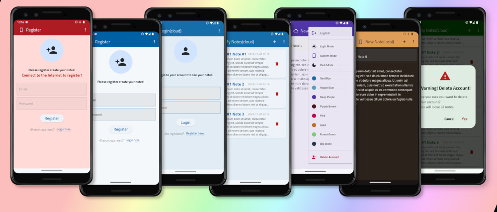

## <!-- My Notes is the Flutter/Dart app based on YouTube Tutorial "Free Flutter Course 35+ hours by Vandad Nahavandipoor-->

<a name="readme-top"></a>

<br />
<div align="center">

[![Contributors][contributors-shield]][contributors-url]
[![Forks][forks-shield]][forks-url]
[![Stargazers][stars-shield]][stars-url]
[![Issues][issues-shield]][issues-url]
[![MIT License][license-shield]][license-url]
[![LinkedIn][linkedin-shield]][linkedin-url]

<!-- PROJECT LOGO -->
<br />

  <a href="https://github.com/jackharbon/flutter_mynotes">
    
  </a>

<br />

<h1 align="center">MY NOTES</h1>

  <p align="center">
    My Notes is the Flutter/Dart app based on YouTube Tutorial<br />
     <a href="https://www.youtube.com/playlist?list=PL6yRaaP0WPkVtoeNIGqILtRAgd3h2CNpT">Free Flutter Course 35+ hours</a> by Vandad Nahavandipoor.<br /> November 2023.
    <br />
    <br />
</div>
<!-- TABLE OF CONTENTS -->
<details>
  <summary>Table of Contents</summary>
  <ul>
    <li>
      <a href="#about-the-project">About The Project</a>
      <ul>
        <li><a href="#app-description">App Description</a></li>
        <li><a href="#built-with">Built With</a></li>
      </ul>
    </li>
    <li>
      <a href="#getting-started">Getting Started</a>
      <ul>
        <li><a href="#prerequisites">Prerequisites</a></li>
        <li><a href="#installation">Installation</a></li>
      </ul>
    </li>
    <li><a href="#roadmap">Roadmap</a></li>
    <li><a href="#license">License</a></li>
    <li><a href="#contact">Contact</a></li>
    <li><a href="#acknowledgments">Acknowledgments</a></li>
  </ul>
</details>
<br />
<br />

<!-- ABOUT THE PROJECT -->

# About The Project



## App Description

<b>Learning Fluttter/Dart | App based on YT tutorial 'Free Flutter Course' from Vandad Nahavandipoor.</br>

As a user, after registering with an email and a password or Google account you can create, edit and delete your notes (with a title, content and a timestamp). Notes are stored simultaneously in the local database and a cloud, which means that you can synchronize your notes with other Android devices. In case of loosing the internet connection, your notes are continuously stored in the local database, and synchronized after regaining the connection.

## Built With

<div align="center">

| Coding                                           | Back-end                                     | Front-end                              |
| ------------------------------------------------ | -------------------------------------------- | -------------------------------------- |
| <i>planning, version control, code editing</i>   | <i>database, authentication, environment</i> | <i>framework and language</i>          |
| [![GitHub][github.com]][github-url]              | [![Node.js][nodejs.org]][nodejs-url]         | [![Flutter][flutter.dev]][flutter-url] |
| [![VSC][visualstudiocode]][visualstudiocode-url] | [![Firebase][firebase.com]][firebase-url]    | [![Dart][dart.dev]][dart-url]          |

</div>

## Features/tech

- [x] Firebase authentication
- [x] Flutter native splash
- [x] SQLite CRUD local storage
- [x] Flex color themes
- [x] GetX Internet connection check snackbar
- [x] Connectivity plus Internet connection check
- [x] App state change notification
- [x] Firestore Database cloud storage
- [x] Bloc state management

<p align="right">(<a href="#readme-top">back to top</a>)</p>

<!-- GETTING STARTED -->

# Getting Started

Feel free to test the app for yourself (excluding commercial purposes).

## Prerequisites

To run the app you need a few pieces of software. The installation process will depend on your computer operating system (Linux, Mac OS, MS Windows), so I have included general instructions, for more detailed steps you need to read the software provider's instructions (docs) for the specific system. And also I DO NOT recommend using [WSL](https://learn.microsoft.com/en-us/windows/wsl/about) (Windows Subsystem for Linux), because of the problems with Android emulation, as WSL does not support GUI applications and SDK for Windows do not work with WSL.

Install necessary software:

- JavaScript runtime environment [Node.js](https://nodejs.org/en/).
- Source code editor like [Visual Studio Code](https://code.visualstudio.com/Download).
- Android SDK with emulator [Android Studio](https://developer.android.com/studio#downloads).
- You may want to install Android phone screen duplicator [scrcpy](https://github.com/Genymobile/scrcpy) (optional) and allow debugging in your phone.
- If you you use physical device to run application, switch off phone screen locking, activate developer options in the phone and check on `Stay awake`.
- You may want to install desktop version of [GitHub](https://desktop.github.com/) (optional).

## Installation

### Dependencies

Clone this Github repository and open it in your IDE (f.e. Visual Studio Code)

1. Change your app domain according to the format: `com.example.mynotes` (use your domain instead `com.example`), you can use find && replace IDE tool.

2. Clean dependencies files:

`flutter clean android`

3. Type those commands in the terminal:

```
flutter pub add cloud_firestore

flutter pub add connectivity_plus

flutter pub add cupertino_icons

flutter pub add firebase_analytics

flutter pub add firebase_auth

flutter pub add firebase_core

flutter pub add flex_color_scheme

flutter pub add flutter_native_splash

flutter pub add get

flutter pub add path

flutter pub add path_provider

flutter pub add provider

flutter pub add shared_preferences

flutter pub add sqflite

flutter pub add test --dev

flutter pub add flutter_lints

flutter pub add intl

flutter pub add bloc

flutter pub add flutter_bloc

flutter pub add equatable

flutter pub add flutter_launcher_icons

flutter pub run flutter_launcher_icons

```

and

```
flutter pub add share_plus

flutter clean

flutter clean android

flutter pub get

```

You can also edit 'pubspec.yaml' and paste those dependencies (don't forget to include a current version - check on: [pub.dev](https://pub.dev/packages)).

4. Add assets to `pubspec.yaml` file:

```
flutter:
  uses-material-design: true
  fonts:
    - family: TitilliumWeb
      fonts:
        - asset: fonts/TitilliumWeb-Black.ttf
          weight: 900
        - asset: fonts/TitilliumWeb-Bold.ttf
          weight: 700
        - asset: fonts/TitilliumWeb-BoldItalic.ttf
          weight: 700
          style: italic
        - asset: fonts/TitilliumWeb-ExtraLight.ttf
          weight: 200
        - asset: fonts/TitilliumWeb-ExtraLightItalic.ttf
          weight: 200
          style: italic
        - asset: fonts/TitilliumWeb-Italic.ttf
          weight: 400
          style: italic
        - asset: fonts/TitilliumWeb-Light.ttf
          weight: 200
        - asset: fonts/TitilliumWeb-LightItalic.ttf
          weight: 200
          style: italic
        - asset: fonts/TitilliumWeb-Regular.ttf
          weight: 400
  assets:
    - assets/icon/icon.png
    - assets/splash/branding_dark.png
    - assets/splash/branding.png
    - assets/splash/splash-invert.png
    - assets/splash/splash.png
    - assets/screenshots.jpg

```

5. Enable multidex support - modify `android/app/build.gradle`. See [StackOverflow](https://stackoverflow.com/questions/49886597/multidex-issue-with-flutter) for details.

```
android {
    defaultConfig {
        multiDexEnabled true
    }
}
```

```
dependencies {
    implementation 'androidx.multidex:multidex:2.0.1'
    implementation(platform("com.google.firebase:firebase-bom:32.4.0"))
    implementation("com.google.firebase:firebase-firestore-ktx")
    implementation "androidx.activity:activity:1.6.0-alpha05"
}
```

In `AndroidManifest.xml` (`android/app/src/main/AndroidManifest.xml`) add:

```
  <application
  ...
  android:enableOnBackInvokedCallback="true"
  ... >
  ...
  </application>

```

6. Create the splash screen

`dart run flutter_native_splash:create`

## Firebase set-up

### Install Firebase tools, create a Firestore database project and configure the project

Type these commands in a terminal:

```
curl -sL https://firebase.tools | bash
firebase login
firebase projects:list
dart pub global activate flutterfire_cli
flutterfire configure -> create project -> chose Android
firebase init -> choose Firebase and Cloud configuration

```

You can check file `lib/firebase_options`.

Help: [Add Firebase to your Flutter app](https://firebase.google.com/docs/flutter/setup?platform=android)

In the [Google Console](https://console.firebase.google.com/) go to Get Started -> Authentication -> Sign-up method -> Native providers -> Email/Password -> Enable.

### Add Cloud Firestore to your project

- Open your [Firebase Console](https://console.firebase.google.com/).

- Go to the `Firestore Database` in the left menu, click `Create database`.

- Switch to the `Native` mode (if you are asked for) and go back to the current panel.

- Choose `Start in production mode` or `Start in test mode`.

- Choose preferred Cloud Firestore location (country) and click `Enable`.

- When Cloud Firestore dashboard is ready you can start setting up the Cloud Firestore.

- If you've chosen `Start in production mode` open the tab `Rules` -> `Edit rules` and change permission read/write to `allow read, write: if request.auth != null;` (to allow user to write, if is authenticated).

```
rules_version = '2';

service cloud.firestore {
  match /databases/{database}/documents {
    match /{document=**} {
      allow read, write: if request.auth != null;
    }
  }
}

```

- Click `Publish` to publish new security rules

- Click `Start Collection` to start, then in the popup windows insert data:

  - Collection ID: `notes` (as a collection name),

  - Document ID: click `Auto ID`,

  - Then add fields:

    - `user_id` -> `string`;
    - `title`->`string`;
    - `text`->`string`;
    - `created_at` -> `timestamp`;

    and click `Save`.

- Check `Data` tab, to confirm if database structure was created correctly.

Help:[Get started with Cloud Firestore](https://firebase.google.com/docs/firestore/quickstart#kotlin+ktx)

## Run a test

```

flutter test test/auth_test.dart

```

<p align="right">(<a href="#readme-top">back to top</a>)</p>

<!-- ROADMAP -->

# Roadmap

- [x] Loading screen (Native Splash)
- [x] Themes settings (Flex Color Scheme)
- [x] Light/dark mode
- [x] Internet connection state checking (Connectivity Plus, GetX)
- [x] Delete user option
- [x] Local (offline) notes storage (SQLite)
- [x] Cloud (online) notes storage (Firestore)
- [x] Online/Offline indicator icon (phone/cloud)
- [x] Show On/Off order numbers, note's content, creation date
- [x] Sort notes by creation date or title alphabetically (ascending/descending order)
- [x] Swipe note to delete
- [x] Edit option for deleting multiple notes
- [x] App icon
- [ ] Seamless offline notes storage, when lost connection
- [ ] Offline/online notes synchronizing
- [ ] Filtering (search) notes
- [ ] Note's tagging (flags)
- [ ] Registering with Google account
- [ ] User settings (first/last name, avatar, themes)

<p align="right">(<a href="#readme-top">back to top</a>)</p>

# License

App is under GNU GENERAL PUBLIC LICENSE Version 3, 29 June 2007.

See <a href="https://github.com/jackharbon/flutter_mynotes/blob/main/LICENSE">`LICENSE.txt` </a> for more information.

<p align="right">(<a href="#readme-top">back to top</a>)</p>

<!-- CONTACT -->

# Contact

## Jacek Harbon

LinkedIn: [@jgharbon](https://www.linkedin.com/in/jgharbon/)

website: [harbon.uk](https://harbon.uk)

email: jacek@harbon.uk

Mastodon: [@jacekharbon](https://mastodon.social/@jacekharbon)

Project Link: [https://github.com/jackharbon/flutter_mynotes](https://github.com/jackharbon/flutter_mynotes)

<p align="right">(<a href="#readme-top">back to top</a>)</p>

<!-- ACKNOWLEDGMENTS -->

# Acknowledgments

- [Node.js](https://nodejs.org/en/)
- [NPM.js](https://www.npmjs.com/)
- [Fluter](https://flutter.dev/)
- [Dart](https://dart.dev/guides/language/language-tour)
- [Dart Pad](https://www.dartpad.dev/?)
- [Visual Studio Code](https://code.visualstudio.com/)
- [Android Studio](https://developer.android.com/studio)
- [Material Design](https://m3.material.io/)

<p align="right">(<a href="#readme-top">back to top</a>)</p>

<!-- MARKDOWN LINKS & IMAGES -->
<!-- https://www.markdownguide.org/basic-syntax/#reference-style-links -->

[contributors-shield]: https://img.shields.io/github/contributors/jackharbon/flutter_mynotes.svg?style=for-the-badge
[contributors-url]: https://github.com/jackharbon/flutter_mynotes/graphs/contributors
[forks-shield]: https://img.shields.io/github/forks/jackharbon/flutter_mynotes.svg?style=for-the-badge
[forks-url]: https://github.com/jackharbon/flutter_mynotes/network/members
[stars-shield]: https://img.shields.io/github/stars/jackharbon/flutter_mynotes.svg?style=for-the-badge
[stars-url]: https://github.com/jackharbon/flutter_mynotes/stargazers
[issues-shield]: https://img.shields.io/github/issues/jackharbon/flutter_mynotes.svg?style=for-the-badge
[issues-url]: https://github.com/jackharbon/flutter_mynotes/issues
[license-shield]: https://img.shields.io/github/license/jackharbon/flutter_mynotes.svg?style=for-the-badge
[license-url]: https://github.com/jackharbon/flutter_mynotes/blob/master/LICENSE.txt
[linkedin-shield]: https://img.shields.io/badge/-LinkedIn-black.svg?style=for-the-badge&logo=linkedin&colorB=555
[linkedin-url]: https://www.linkedin.com/in/jgharbon/
[product-screenshot]: images/screenshot.png
[github.com]: https://img.shields.io/badge/GitHub-000000?style=for-the-badge&logo=github&logoColor=white
[github-url]: https://github.com/
[flutter.dev]: https://img.shields.io/badge/flutter-1A1744?style=for-the-badge&logo=flutter&logoColor=45C9FA
[flutter-url]: https://flutter.dev
[dart.dev]: https://img.shields.io/badge/dart-838383?style=for-the-badge&logo=dart&logoColor=055A9D
[dart-url]: https://dart.dev
[firebase.com]: https://img.shields.io/badge/firebase-039BE6?style=for-the-badge&logo=firebase&logoColor=FFA611
[firebase-url]: https://firebase.com/
[nodejs.org]: https://img.shields.io/badge/node.js-7EBB00?style=for-the-badge&logo=nodedotjs&logoColor=313429
[nodejs-url]: https://nodejs.org/
[visualstudiocode]: https://img.shields.io/badge/visualstudio-3CA4EA?style=for-the-badge&logo=visualstudio&logoColor=white
[visualstudiocode-url]: https://code.visualstudio.com
